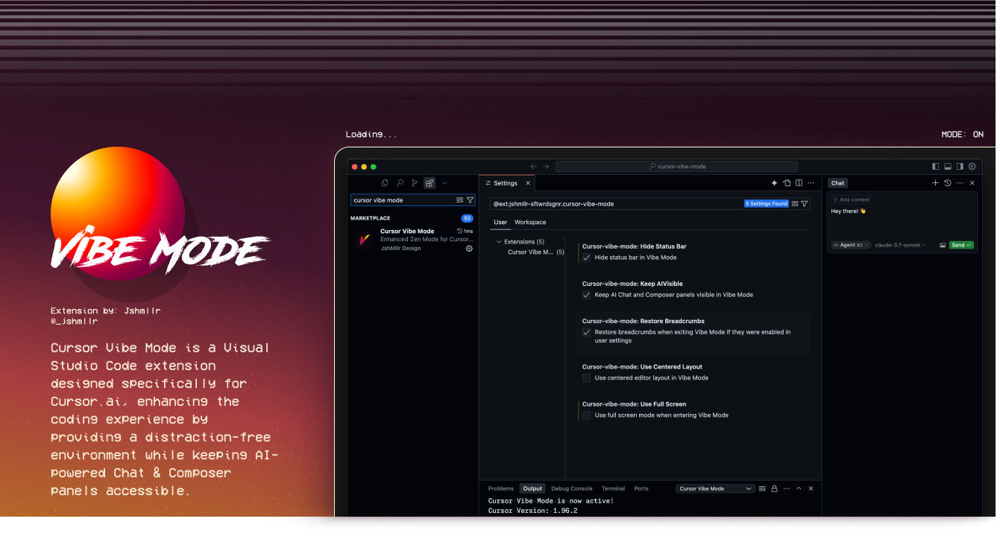

# Cursor Vibe Mode

Cursor Vibe Mode is a Visual Studio Code extension designed specifically for Cursor.ai, enhancing the coding experience by providing a distraction-free environment while keeping AI-powered Chat and Composer panels accessible.

## Features

- **Distraction-Free Coding**: Enter a clean, focused environment with minimal UI elements
- **Smooth Transitions**: Elegant animations when entering and exiting Vibe Mode
- **Non-Centered Layout**: Maintains a non-centered editor layout by default (configurable)
- **Flexible AI Layout**: Choose between side-by-side or stacked layouts for AI panels
- **Customizable UI**: Configure which UI elements to show or hide in Vibe Mode
- **Quick Toggles**: Easily switch between layouts with keyboard shortcuts
- **Cursor AI Integration**: Special commands for toggling the AI sidebar in Cursor AI
- **Explicit Enable/Disable**: Separate commands to explicitly enable or disable Vibe Mode
- **Cursor-Optimized**: Designed specifically for Cursor AI's unique UI structure

## Installation

1. Open Cursor.ai
2. Go to Extensions (Ctrl+Shift+X / Cmd+Shift+X)
3. Search for "Cursor Vibe Mode"
4. Click Install

Alternatively, you can install the extension manually:
1. Download the `.vsix` file from the releases
2. In Cursor.ai, open the Command Palette (Ctrl+Shift+P / Cmd+Shift+P)
3. Type "Extensions: Install from VSIX..." and select it
4. Navigate to and select the downloaded `.vsix` file

## Usage

### Commands

- **Toggle Vibe Mode**: Enter or exit Vibe Mode
  - Keyboard shortcut: `Ctrl+K V` / `Cmd+K V`
  - Command Palette: "Toggle Vibe Mode"

- **Enable Vibe Mode**: Explicitly enable Vibe Mode
  - Keyboard shortcut: `Ctrl+K E` / `Cmd+K E`
  - Command Palette: "Enable Vibe Mode"

- **Disable Vibe Mode**: Explicitly disable Vibe Mode
  - Keyboard shortcut: `Ctrl+K D` / `Cmd+K D`
  - Command Palette: "Disable Vibe Mode"

- **Toggle AI Layout**: Switch between side and bottom layouts for AI panels
  - Keyboard shortcut: `Ctrl+K L` / `Cmd+K L`
  - Command Palette: "Toggle AI Layout (Side/Bottom)"

- **Toggle AI Sidebar**: Specifically toggle the AI sidebar in Cursor AI
  - Keyboard shortcut: `Ctrl+Cmd+B`
  - Command Palette: "Toggle AI Sidebar"

### Settings

This extension contributes the following settings:

* `cursor-vibe-mode.aiPanelPosition`: Position of AI panels in Vibe Mode - "side" or "bottom" (default: `side`)
* `cursor-vibe-mode.hideStatusBar`: Hide status bar in Vibe Mode (default: `false`)
* `cursor-vibe-mode.useFullScreen`: Use full screen mode when entering Vibe Mode (default: `true`)
* `cursor-vibe-mode.restoreBreadcrumbs`: Restore breadcrumbs when exiting Vibe Mode if they were enabled in user settings (default: `true`)
* `cursor-vibe-mode.useCenteredLayout`: Use centered editor layout in Vibe Mode (default: `false`)

Note: Breadcrumbs are always hidden in Vibe Mode to provide a cleaner interface.

## How It Works

Cursor Vibe Mode provides a distraction-free coding environment while keeping AI features accessible:

1. When you activate Vibe Mode, the extension applies your preferred UI settings with smooth animations
2. It hides distracting UI elements like the sidebar and breadcrumbs
3. Based on your settings, it applies your preferred layout and UI visibility options
4. When you exit Vibe Mode, it restores your UI based on your configuration settings

## Cursor AI-Specific Features

This extension is specifically designed for Cursor AI and includes:

- Integration with Cursor AI's auxiliarybar (the AI sidebar)
- Support for keeping the AI sidebar visible in Vibe Mode
- Commands that work with Cursor AI's unique UI layout
- Proper handling of Cursor's "Secondary Side Bar" (the AI panel)
- Optimized to avoid conflicts with Cursor's modified VS Code UI

## Improved Error Handling and Logging

Cursor Vibe Mode includes robust error handling and logging:

- Detailed timestamped logs for all operations
- Graceful degradation when commands fail
- Multiple fallback mechanisms for AI sidebar operations
- Command availability detection for different Cursor versions
- User-friendly error messages with actionable options
- Comprehensive troubleshooting information

To access logs:
1. Open the Output panel (View > Output)
2. Select "Cursor Vibe Mode" from the dropdown
3. Review the logs for detailed information about operations

## Why Vibe Mode?

Traditional distraction-free modes in code editors often hide all UI elements. However, in an AI-powered editor like Cursor.ai, you often want to maintain access to AI features while still achieving a focused environment. Vibe Mode bridges this gap by providing:

- A clean, focused coding environment with optional centered layout
- Continued access to AI assistance
- Flexible layout options for different workflows
- Customizable UI to match your preferences
- Smooth, elegant transitions between modes

## Requirements

- Cursor.ai (VS Code with AI capabilities)
- VS Code 1.93.0 or higher

## Known Issues

- None currently

## Release Notes

### 0.0.3

- Added smooth animations when entering and exiting Vibe Mode
- Added new setting for centered layout (`useCenteredLayout`)
- Removed dependency on Zen Mode for better control and reliability
- Improved UI state management
- Enhanced error handling

### 0.0.2

- Added separate commands for explicitly enabling and disabling Vibe Mode
- Added keyboard shortcuts for enable (`Ctrl+K E` / `Cmd+K E`) and disable (`Ctrl+K D` / `Cmd+K D`) commands
- Automatic breadcrumbs hiding when in Vibe Mode
- Added new setting to control breadcrumbs restoration
- Completely redesigned state management to avoid UI detection issues
- Optimized for Cursor AI's unique UI structure
- Fixed issues with activity bar references
- Improved centered layout handling

### 0.0.1

- Initial release of Cursor Vibe Mode
- Basic Vibe Mode functionality with AI panel visibility
- Support for side and bottom AI panel layouts
- Customizable UI element visibility
- Special integration with Cursor AI's auxiliarybar toggle
- Non-centered layout for a more natural coding experience

---

## Contributing

Contributions are welcome! Feel free to submit issues or pull requests on the [GitHub repository](https://github.com/jshmllr/cursor-vibe-mode).

## License

This extension is licensed under the MIT License.

**Enjoy your focused coding sessions with Cursor Vibe Mode!**
